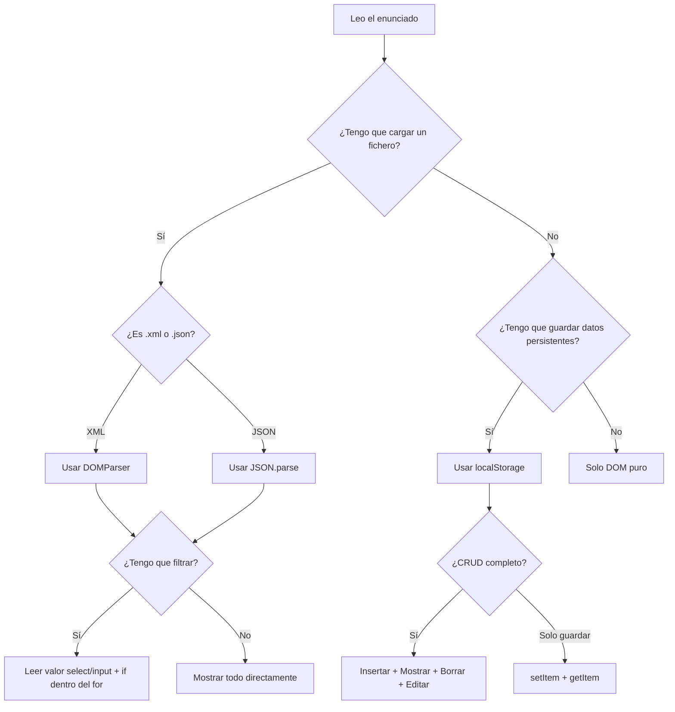
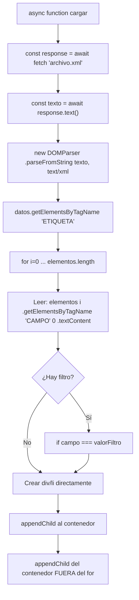
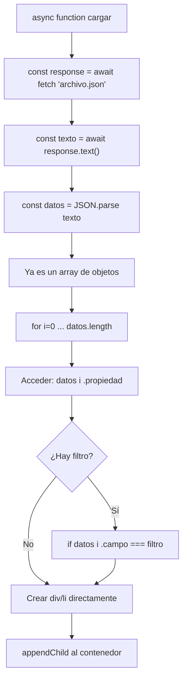
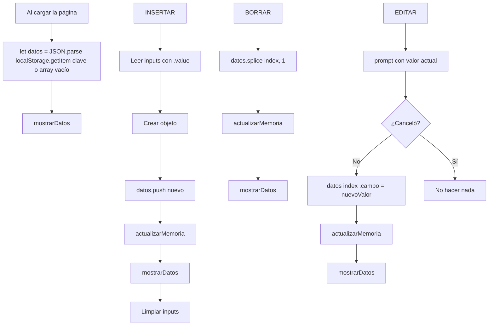
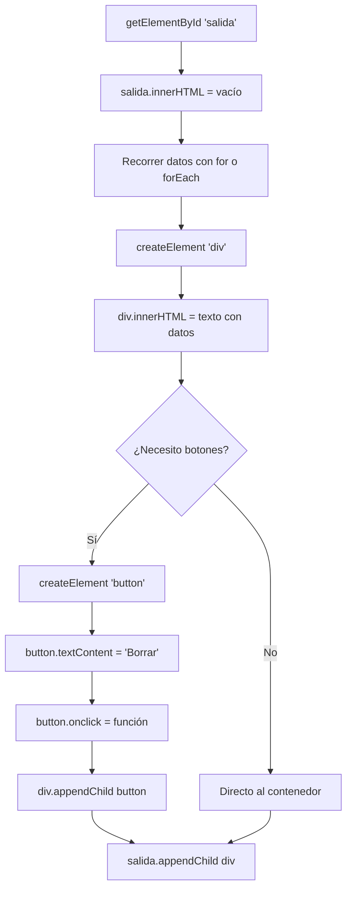
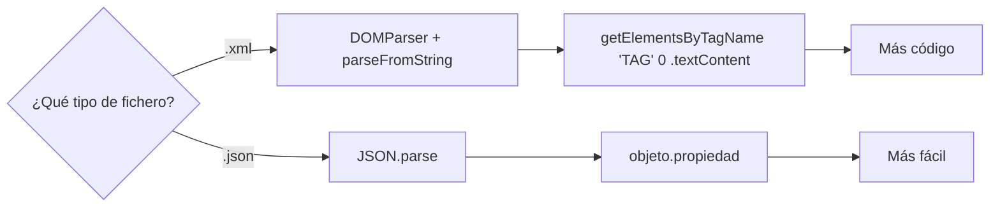

# Apuntes Examen — JavaScript II

> Basados en los ejercicios del Simulacro de Examen. Lo que entra: **fetch**, **manejo del DOM** y **localStorage**.
> NO entra callbacks ni AJAX clásico.


---


## Índice

1. [Fetch: Cargar ficheros](#1-fetch-cargar-ficheros)
2. [Parsear XML con DOMParser](#2-parsear-xml-con-domparser)
3. [Parsear JSON](#3-parsear-json)
4. [Manejo del DOM](#4-manejo-del-dom)
5. [Borrar elementos](#5-borrar-elementos)
6. [Insertar datos desde formularios](#6-insertar-datos-desde-formularios)
7. [Filtrar datos con select](#7-filtrar-datos-con-select)
8. [LocalStorage — CRUD paso a paso](#8-localstorage--crud-paso-a-paso)
9. [Ejemplos](#9-ejemplos)
10. [Errores típicos](#10-errores-típicos)
11. [Mapas mentales](#11-mapas-mentales)


---


## 1. Fetch: Cargar ficheros

`fetch` sirve para cargar archivos (XML, JSON, etc.) de forma **asíncrona**.
La función que use fetch **DEBE** ser `async` y se usa `await` para esperar la respuesta.

### Estructura base (siempre es igual)

```javascript
async function cargarFichero() {
    const response = await fetch("archivo.xml");  // 1. Pedir el fichero
    const texto = await response.text();           // 2. Convertirlo a texto
    // ... luego parsearlo según el tipo (XML o JSON)
}
```

> [!IMPORTANT]
> **Siempre 2 `await`**: uno para `fetch()` y otro para `.text()`. Si te olvidas de alguno, no funcionará.

> [!CAUTION]
> La función **DEBE** llevar `async` delante. Sin `async` no puedes usar `await`.


---


## 2. Parsear XML con DOMParser

Cuando el fichero es **XML**, necesitas convertir el texto en un "documento XML" para poder navegar por sus etiquetas.

### Ejemplo completo (Ejercicio 1 del Simulacro)

```javascript
async function cargarFichero() {
    // 1. Cargar fichero
    const response = await fetch("catalogo.xml");
    const texto = await response.text();

    // 2. Parsear a XML → CLAVE: usar DOMParser
    const datos = new DOMParser().parseFromString(texto, "text/xml");

    // 3. Obtener todos los elementos por nombre de etiqueta
    const Cds = datos.getElementsByTagName("CD");

    // 4. Recorrer con un for clásico
    for (let i = 0; i < Cds.length; i++) {
        let titulo = Cds[i].getElementsByTagName("TITLE")[0].textContent;
        let pais   = Cds[i].getElementsByTagName("COUNTRY")[0].textContent;
    }
}
```

### Cosas que siempre se olvidan del XML

| Concepto | Código | Ojo |
|----------|--------|-----|
| Crear parser | `new DOMParser()` | Los paréntesis son opcionales pero ponlos |
| Parsear texto | `.parseFromString(texto, "text/xml")` | El 2º argumento **siempre** `"text/xml"` |
| Obtener etiquetas | `.getElementsByTagName("NOMBRE")` | Devuelve una **lista**, no un solo elemento |
| Leer el texto de un nodo | `[0].textContent` | **SIEMPRE** poner `[0]` porque devuelve lista |

> [!WARNING]
> **El `[0]` después de `getElementsByTagName` es OBLIGATORIO.** Sin el `[0]` te devuelve la lista entera, no el contenido.
>
> ```javascript
> // MAL - Te da un HTMLCollection, no el texto
> Cds[i].getElementsByTagName("TITLE").textContent
>
> // BIEN - Accedes al primer elemento y luego a su texto
> Cds[i].getElementsByTagName("TITLE")[0].textContent
> ```


---


## 3. Parsear JSON

Cuando el fichero es **JSON**, es mucho más sencillo. Se parsea directamente a un array de objetos JS.

### Ejemplo completo (Ejercicio 3 del Simulacro)

```javascript
async function cargarJSON() {
    // 1. Cargar fichero
    const response = await fetch("coche.json");
    const texto = await response.text();

    // 2. Parsear a objeto JavaScript
    const coches = JSON.parse(texto);

    // 3. Recorrer directamente como array de objetos
    for (let i = 0; i < coches.length; i++) {
        let marca = coches[i].marca;           // Acceso directo con punto
        let pais  = coches[i].lugar_origen;    // No hace falta getElementsByTagName
    }
}
```

### Comparación XML vs JSON

| Operación | XML | JSON |
|-----------|-----|------|
| Parsear | `new DOMParser().parseFromString(texto, "text/xml")` | `JSON.parse(texto)` |
| Obtener lista | `.getElementsByTagName("etiqueta")` | Ya es un array, accedes directo |
| Leer un campo | `nodo.getElementsByTagName("CAMPO")[0].textContent` | `objeto.campo` |
| Complejidad | Alta (nodos, hijos, textContent) | Baja (objetos y propiedades) |

JSON es más fácil porque después de `JSON.parse()` ya tienes un array de objetos normales de JS. XML requiere navegar por el árbol de nodos.


---


## 4. Manejo del DOM

Esta es la parte más importante del examen. Tienes que saber crear elementos HTML desde JavaScript y meterlos en la página.

### Métodos clave

```javascript
// OBTENER un elemento que ya existe en el HTML
const divSalida = document.getElementById("salida");

// CREAR un elemento nuevo (div, button, span, li, ol...)
const divNuevo = document.createElement("div");

// METER CONTENIDO en el elemento
divNuevo.innerHTML = "<strong>Nombre:</strong> Pepe<br>";  // Con HTML
divNuevo.textContent = "Texto plano sin HTML";              // Solo texto

// DAR ESTILOS en línea
divNuevo.style.border = "1px solid black";
divNuevo.style.padding = "20px";
divNuevo.style.maxWidth = "200px";

// AÑADIR el elemento al DOM (hacerlo visible en la página)
divSalida.appendChild(divNuevo);

// LIMPIAR un contenedor antes de repintar
divSalida.innerHTML = "";

// ELIMINAR un elemento concreto
divNuevo.remove();
```


### Patrón típico: Recorrer datos y crear divs (Ejercicio 2)

```javascript
async function filtrarCategoria() {
    const salida = document.getElementById("salida");
    salida.innerHTML = "";  // Siempre limpiar antes

    for (let i = 0; i < productos.length; i++) {
        let categoria = productos[i].getElementsByTagName("categoria")[0].textContent;

        if (categoria === categoriaElegida) {
            const divProducto = document.createElement("div");
            divProducto.style.border = "1px solid black";
            divProducto.style.padding = "20px";

            let txt = "";
            txt += "<strong>Nombre</strong>: " + productos[i].getElementsByTagName("nombre")[0].textContent + "<br>";
            txt += "<strong>Categoría</strong>: " + categoria + "<br>";
            txt += "<strong>Precio</strong>: " + productos[i].getElementsByTagName("precio")[0].textContent + " € <br>";

            divProducto.innerHTML = txt;
            salida.appendChild(divProducto);
        }
    }
}
```


### innerHTML vs textContent

- **`innerHTML`** → interpreta etiquetas HTML (`<strong>`, `<br>`, etc.)
- **`textContent`** → solo texto plano, ignora las etiquetas

En el examen usarás `innerHTML` casi siempre porque sueles querer negritas, saltos de línea, etc.


### Dos formas de construir el texto dentro del div

```javascript
// FORMA 1: Concatenación con +
let txt = "";
txt += "<strong>Nombre</strong>: " + alumno.nombre + "<br>";
txt += "<strong>Nota</strong>: " + alumno.nota + "<br>";
divAlumno.innerHTML = txt;

// FORMA 2: Template Literals con backticks (más moderno)
divAlumno.innerHTML = `<strong>Nombre:</strong> ${alumno.nombre} <br> <strong>Nota:</strong> ${alumno.nota}`;
```

Las template literals (con backticks `` ` ``) son más cómodas. Usas `${variable}` para meter valores.


---


## 5. Borrar elementos

### Opción A — Borrar del array + del DOM (Ejercicio 1)

```javascript
const btnBorrar = document.createElement('button');
btnBorrar.textContent = 'Borrar CD';

btnBorrar.onclick = () => {
    let indexCd = listaCds.indexOf(cd);      // Buscar posición
    listaCds.splice(indexCd, 1);             // Borrar del array
    divCd.remove();                          // Borrar del DOM
};

divCd.appendChild(btnBorrar);
```


### Opción B — Borrar por índice y repintar (Ejercicio 4, con forEach)

```javascript
alumnos.forEach((alumno, index) => {
    const btnBorrar = document.createElement("button");
    btnBorrar.textContent = "Borrar";
    btnBorrar.onclick = () => borrarAlumno(index);
    divAlumno.appendChild(btnBorrar);
});

function borrarAlumno(index) {
    alumnos.splice(index, 1);
    actualizarMemoria();
    mostrarAlumnos();
}
```

Métodos importantes:

- **`splice(indice, cantidad)`** → modifica el array original y quita `cantidad` elementos desde `indice`.
- **`indexOf(elemento)`** → devuelve la posición del elemento en el array. Devuelve `-1` si no lo encuentra.

### ¿Cuándo usar cada estrategia?

| Estrategia | Cuándo usarla | Ventaja |
|------------|---------------|---------|
| `divCd.remove()` (solo DOM) | Si no necesitas repintar todo | Más eficiente |
| `mostrarAlumnos()` (repintar todo) | Si usas localStorage o hay lógica compleja | Más seguro |


---


## 6. Insertar datos desde formularios

```javascript
function insertarCD() {
    // 1. Leer los valores de los inputs
    const titulo  = document.getElementById("inputTitulo").value;
    const artista = document.getElementById("inputArtista").value;
    const precio  = document.getElementById("inputPrecio").value;

    // 2. Crear un objeto
    let nuevoCd = {
        titulo: titulo,
        artista: artista,
        precio: precio,
        esManual: true
    };

    // 3. Añadirlo al array
    listaCds.push(nuevoCd);

    // 4. Limpiar los inputs
    document.getElementById("inputTitulo").value = "";
    document.getElementById("inputArtista").value = "";
    document.getElementById("inputPrecio").value = "";

    // 5. Repintar la lista
    mostrarCds();
}
```

> [!CAUTION]
> **NO olvides limpiar los inputs** después de insertar. Es un detalle que da puntos y que se olvida siempre.

El truco de `esManual: true` se usa en el Ejercicio 1 para que al recargar el XML no se pierdan los CDs insertados a mano:

```javascript
listaCds = listaCds.filter(cd => cd.esManual === true);
```

Así filtra el array antes de volver a cargar los del XML, quedándose solo con los manuales.


---


## 7. Filtrar datos con select

### Obtener el valor seleccionado

```javascript
function filtrarCategoria() {
    const selectCategorias = document.getElementById("categorias");
    const categoriaElegida = selectCategorias.value;

    if (categoria === categoriaElegida) {
        // ... mostrar solo los que coincidan
    }
}
```

### HTML del select (por si hay que hacerlo)

```html
<label for="categorias">Elige una opción:</label>
<select name="categorias" id="categorias">
    <option value="Lácteos">Lácteos</option>
    <option value="Panadería">Panadería</option>
    <option value="Cereales">Cereales</option>
</select>

<button onclick="filtrarCategoria()">Filtrar</button>
```

El `value` del `<option>` es lo que obtienes con `selectElement.value`. El texto entre las etiquetas es lo que ve el usuario.


---


## 8. LocalStorage — CRUD paso a paso

LocalStorage guarda datos en el navegador que **persisten** aunque cierres la página.
Es el Ejercicio 4 del Simulacro y es MUY probable que caiga.

### Los 4 métodos que debes saber

```javascript
// GUARDAR → siempre convertir a string
localStorage.setItem("clave", JSON.stringify(miArray));

// LEER → siempre convertir de string a objeto
let datos = JSON.parse(localStorage.getItem("clave"));

// BORRAR una clave
localStorage.removeItem("clave");

// BORRAR TODO
localStorage.clear();
```

> [!CAUTION]
> **LocalStorage SOLO guarda strings.** Si guardas un array u objeto directamente, se convierte a `"[object Object]"` y pierdes los datos. **SIEMPRE** `JSON.stringify()` para guardar y `JSON.parse()` para leer.


---


### Paso 1 — Inicializar al cargar la página

Lo primero es **intentar leer** lo que haya guardado de antes. Si no hay nada, empiezas con un array vacío.

```javascript
let alumnos = JSON.parse(localStorage.getItem("misAlumnos")) || [];
```

¿Qué pasa aquí?

- `localStorage.getItem("misAlumnos")` → si no hay nada, devuelve `null`.
- `JSON.parse(null)` → da `null`.
- `null || []` → el operador `||` dice: "si lo de la izquierda es falsy, usa lo de la derecha". Se queda con `[]`.

Justo después, pintas en pantalla lo que haya:

```javascript
mostrarAlumnos();
```


---


### Paso 2 — Función "guardar en memoria"

La llamas **cada vez que modifiques el array** (insertar, borrar, editar):

```javascript
function actualizarMemoria() {
    localStorage.setItem("misAlumnos", JSON.stringify(alumnos));
}
```

Convierte el array a string y lo guarda. Cuando recargues la página, los datos siguen ahí.


---


### Paso 3 — Insertar (Create)

```javascript
function insertarAlumno() {
    const inputNombre = document.getElementById("inputNombre");
    const inputNota = document.getElementById("inputNota");

    let nuevoAlumno = {
        nombre: inputNombre.value,
        nota: inputNota.value
    };

    alumnos.push(nuevoAlumno);

    actualizarMemoria();
    mostrarAlumnos();

    inputNombre.value = "";
    inputNota.value = "";
}
```

El orden es: **push → guardar → repintar → limpiar inputs.**


---


### Paso 4 — Mostrar (Read)

Recorrer el array y crear un div por cada elemento:

```javascript
function mostrarAlumnos() {
    const salida = document.getElementById("salida");
    salida.innerHTML = "";

    alumnos.forEach((alumno, index) => {
        const divAlumno = document.createElement("div");
        divAlumno.style.border = "1px solid black";
        divAlumno.style.padding = "10px";
        divAlumno.style.marginBottom = "10px";

        divAlumno.innerHTML = `
            <strong>Nombre:</strong> ${alumno.nombre} <br>
            <strong>Nota:</strong> ${alumno.nota} <br><br>
        `;

        const btnBorrar = document.createElement("button");
        btnBorrar.textContent = "Borrar";
        btnBorrar.onclick = () => borrarAlumno(index);

        const btnEditar = document.createElement("button");
        btnEditar.textContent = "Editar";
        btnEditar.style.marginLeft = "10px";
        btnEditar.onclick = () => editarAlumno(index);

        divAlumno.appendChild(btnBorrar);
        divAlumno.appendChild(btnEditar);
        salida.appendChild(divAlumno);
    });
}
```

El **segundo parámetro** de `forEach`, `index`, nos da la posición (0, 1, 2...). Lo necesitamos para borrar y editar.


---


### Paso 5 — Borrar (Delete)

```javascript
function borrarAlumno(index) {
    alumnos.splice(index, 1);
    actualizarMemoria();
    mostrarAlumnos();
}
```

`splice(index, 1)` quita 1 elemento en esa posición.


---


### Paso 6 — Editar (Update)

Usamos `prompt()` porque es la forma más rápida en un examen:

```javascript
function editarAlumno(index) {
    let nuevoNombre = prompt("Nuevo nombre:", alumnos[index].nombre);
    let nuevaNota = prompt("Nueva nota:", alumnos[index].nota);

    if (nuevoNombre !== null && nuevaNota !== null) {
        alumnos[index].nombre = nuevoNombre;
        alumnos[index].nota = nuevaNota;

        actualizarMemoria();
        mostrarAlumnos();
    }
}
```

`prompt()` devuelve `null` si el usuario pulsa Cancelar, por eso comprobamos `!== null`.


---


### Resumen — El patrón siempre es el mismo

Da igual si insertas, borras o editas, **las dos últimas líneas son siempre iguales**:

```javascript
actualizarMemoria();   // 1. Guardar en localStorage
mostrarAlumnos();      // 2. Repintar en pantalla
```

> [!IMPORTANT]
> Si te falta `actualizarMemoria()` → los cambios se pierden al recargar.
> Si te falta `mostrarAlumnos()` → los cambios no se ven en pantalla.
> **SIEMPRE las dos.**


---


## 9. Ejemplos

### Cargar XML y filtrar

```javascript
let listaDatos = [];

async function cargarXML() {
    const response = await fetch("fichero.xml");
    const texto = await response.text();
    const datos = new DOMParser().parseFromString(texto, "text/xml");
    const elementos = datos.getElementsByTagName("ETIQUETA_PADRE");

    listaDatos = [];

    for (let i = 0; i < elementos.length; i++) {
        let campo = elementos[i].getElementsByTagName("CAMPO")[0].textContent;

        if (campo === "VALOR_FILTRO") {
            let obj = {
                campo1: elementos[i].getElementsByTagName("CAMPO1")[0].textContent,
                campo2: elementos[i].getElementsByTagName("CAMPO2")[0].textContent,
            };
            listaDatos.push(obj);
        }
    }
    mostrarDatos();
}
```


### Cargar JSON y filtrar

```javascript
async function cargarJSON() {
    const response = await fetch("fichero.json");
    const texto = await response.text();
    const datos = JSON.parse(texto);

    for (let i = 0; i < datos.length; i++) {
        if (datos[i].campo === "filtro") {
            // crear div, meter texto, appendChild
        }
    }
}
```


### Mostrar datos directamente, sin array

**NO usa array global.** Va creando elementos y los añade al DOM dentro del bucle. Más sencilla si solo hay que mostrar y borrar del DOM sin persistir.

```javascript
async function cargarYMostrar() {
    const response = await fetch("fichero.xml");
    const texto = await response.text();
    const datos = new DOMParser().parseFromString(texto, "text/xml");
    const elementos = datos.getElementsByTagName("ETIQUETA");

    const contenedor = document.getElementById("demo");
    contenedor.innerHTML = "";

    let lista = document.createElement("ol");

    for (let i = 0; i < elementos.length; i++) {
        if (elementos[i].getElementsByTagName("CAMPO")[0].textContent === "filtro") {
            let fila = document.createElement("li");
            let texto = document.createElement("span");
            texto.textContent = elementos[i].getElementsByTagName("TITULO")[0].textContent;

            fila.appendChild(texto);

            let botonBorrar = document.createElement("button");
            botonBorrar.textContent = "X";
            botonBorrar.addEventListener("click", () => { fila.remove() });

            fila.appendChild(botonBorrar);
            lista.appendChild(fila);
        }
    }
    contenedor.appendChild(lista);  // FUERA del for
}
```

¿Cuándo usar esta forma? Cuando solo necesitas mostrar y borrar visualmente, sin guardar cambios ni repintar. El botón borrar simplemente hace `fila.remove()`.


### Mostrar datos con array + repintar

Usa un array global y una función separada que repinta todo. Necesaria cuando trabajas con CRUD o localStorage.

```javascript
function mostrarDatos() {
    const salida = document.getElementById("salida");
    salida.innerHTML = "";

    listaDatos.forEach((item, index) => {
        const div = document.createElement("div");
        div.innerHTML = `<strong>Campo1:</strong> ${item.campo1}<br>`;

        const btnBorrar = document.createElement("button");
        btnBorrar.textContent = "Borrar";
        btnBorrar.onclick = () => {
            listaDatos.splice(index, 1);
            mostrarDatos();
        };

        div.appendChild(btnBorrar);
        salida.appendChild(div);
    });
}
```


### ¿Cuándo usar cada una?

| | Sin array (directa) | Con array (repintar) |
|---|---|---|
| Necesitas localStorage | No vale | Necesitas esta |
| Solo mostrar y borrar | Perfecta | También vale |
| Insertar desde formulario | Complicado | Fácil (push + repintar) |
| Editar elementos | Muy difícil | Fácil (modificar + repintar) |


---


## 10. Errores típicos

| Error | Consecuencia | Solución |
|-------|-------------- |----------|
| Olvidar `async` en la función | `await` da error de sintaxis | Poner `async function nombre()` |
| Olvidar el `[0]` en XML | `undefined` o `HTMLCollection` | `getElementsByTagName("X")[0].textContent` |
| No limpiar `salida.innerHTML = ""` | Los datos se duplican | Siempre limpiar ANTES del bucle |
| No llamar a `mostrarDatos()` tras modificar | Los cambios no se ven | Llamar siempre al final |
| `setItem` sin `JSON.stringify` | Se guarda `[object Object]` | Siempre `JSON.stringify(array)` |
| `getItem` sin `JSON.parse` | Obtienes un string, no un array | Siempre `JSON.parse(...)` |
| No limpiar los inputs tras insertar | Quedan los datos del anterior | `input.value = ""` |
| Usar `=` en vez de `===` | Puede funcionar pero mala práctica | Siempre usar `===` |
| `appendChild` dentro del `if` en vez de fuera | Solo se añade si cumple la condición | Mover fuera si es el contenedor |
| `mostrarDatos()` dentro del bucle for | Se repinta por cada iteración | Ponerlo **FUERA** del for |


### Checklist antes de entregar

- [ ] ¿Las funciones con `fetch` tienen `async`?
- [ ] ¿Hay **dos** `await` (fetch y .text())?
- [ ] ¿XML tiene `new DOMParser().parseFromString(texto, "text/xml")`?
- [ ] ¿JSON tiene `JSON.parse(texto)`?
- [ ] ¿Accedo a campos XML con `getElementsByTagName("X")[0].textContent`?
- [ ] ¿Limpio `salida.innerHTML = ""` antes de repintar?
- [ ] ¿Llamo a `mostrarDatos()` después de modificar el array?
- [ ] ¿LocalStorage usa `JSON.stringify` al guardar y `JSON.parse` al leer?
- [ ] ¿Limpio los inputs después de insertar?
- [ ] ¿Los `appendChild` están en el orden correcto?


---


## 11. Mapas mentales

### Mapa 1 — ¿Qué tipo de ejercicio me ha caído?




---


### Mapa 2 — Cargar un fichero XML




---


### Mapa 3 — Cargar un fichero JSON




---


### Mapa 4 — CRUD con localStorage




---


### Mapa 5 — Crear y montar elementos en el DOM




---


### Mapa 6 — XML vs JSON (decisión rápida)




---


> **Mucha suerte en el examen.** Estos apuntes cubren el 100% de los patrones del Simulacro.
