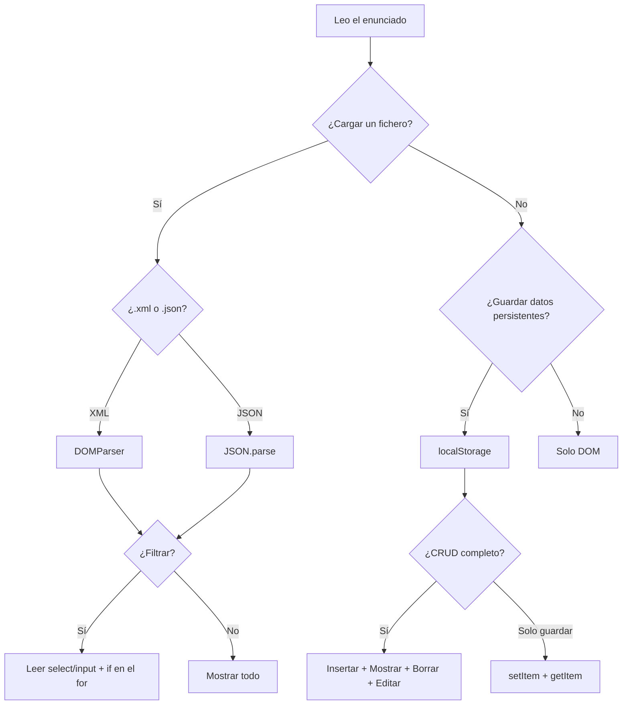
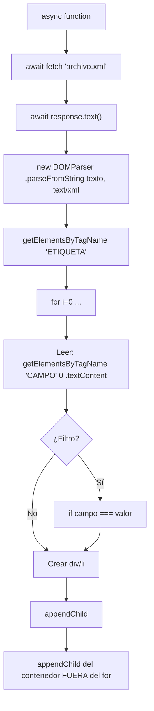
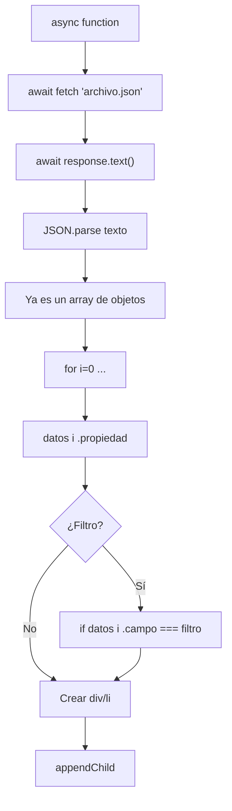
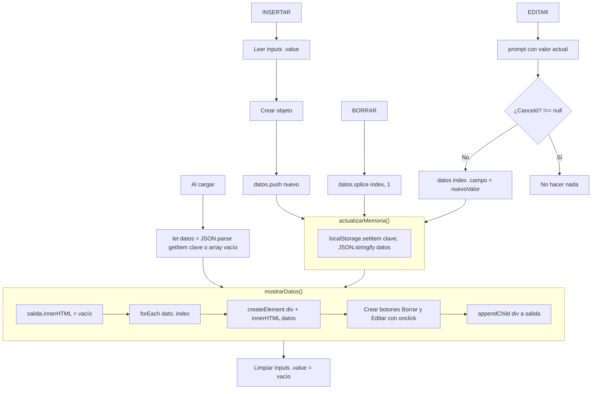
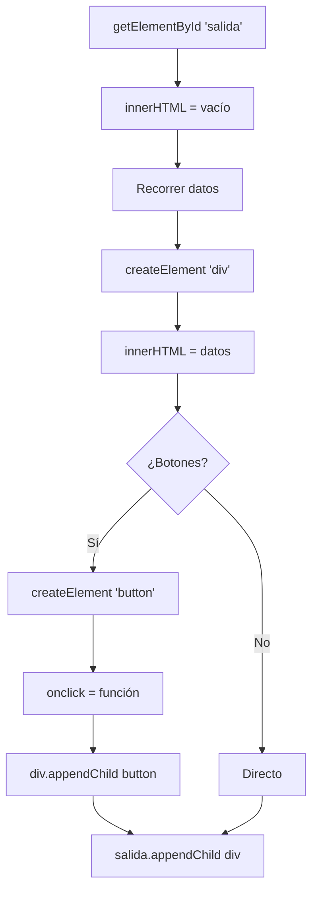

# Resumen Rápido — JavaScript II

> Chuleta de puntos clave para el examen. Para ver ejercicios completos, consultar `Apuntes_Examen_JS2.md`.


---


## Fetch

- `fetch` carga archivos de forma asíncrona.
- La función **siempre** lleva `async` delante.
- **Siempre hay dos `await`**:

```javascript
async function cargar() {
    const response = await fetch("archivo.xml");   // await 1
    const texto = await response.text();            // await 2
    // parsear según tipo...
}
```

- Después de obtener el texto, hay que **parsearlo** según el tipo (XML o JSON).


---


## XML — Parsear con DOMParser

- Convertir texto a documento XML navegable:

```javascript
const datos = new DOMParser().parseFromString(texto, "text/xml");
```

- Obtener elementos por etiqueta (devuelve una **lista**):

```javascript
const elementos = datos.getElementsByTagName("CD");
```

- Leer el contenido de un campo:

```javascript
elementos[i].getElementsByTagName("TITLE")[0].textContent
//                                         ^^^
//                              EL [0] ES OBLIGATORIO
```

- Se recorre con un `for` clásico: `for (let i = 0; i < elementos.length; i++)`


---


## JSON — Parsear con JSON.parse

- Mucho más sencillo que XML:

```javascript
const coches = JSON.parse(texto);   // Ya es un array de objetos JS
```

- Acceso directo a las propiedades:

```javascript
coches[i].marca          // Con punto, sin getElementsByTagName
coches[i].lugar_origen
```

### Comparación rápida

| | XML | JSON |
|---|---|---|
| Parsear | `new DOMParser().parseFromString(texto, "text/xml")` | `JSON.parse(texto)` |
| Leer campo | `nodo.getElementsByTagName("X")[0].textContent` | `objeto.propiedad` |


---


## DOM — Crear y montar elementos

```javascript
// Obtener elemento existente
const salida = document.getElementById("salida");

// Crear elemento nuevo
const div = document.createElement("div");

// Meter contenido
div.innerHTML = "<strong>Nombre:</strong> Pepe<br>";    // interpreta HTML
div.textContent = "Solo texto plano";                    // ignora HTML

// Estilos en línea
div.style.border = "1px solid black";
div.style.padding = "10px";

// Añadir al DOM
salida.appendChild(div);

// Limpiar contenedor
salida.innerHTML = "";

// Eliminar elemento concreto
div.remove();
```

Texto dentro — dos formas:

```javascript
// Concatenación
let txt = "";
txt += "<strong>Nombre</strong>: " + valor + "<br>";

// Template literals (más limpio)
div.innerHTML = `<strong>Nombre:</strong> ${valor}`;
```


---


## Borrar elementos

Dos estrategias:

```javascript
// OPCIÓN A — Solo del DOM (rápido, no toca el array)
elemento.remove();

// OPCIÓN B — Del array + repintar (necesario con localStorage)
array.splice(index, 1);
mostrarDatos();
```

Métodos de array:

- `splice(indice, cantidad)` → quita elementos (modifica el original)
- `indexOf(elemento)` → posición en el array (-1 si no existe)


---


## Insertar desde formularios

```javascript
// Leer valor de un input
const valor = document.getElementById("inputId").value;

// Crear objeto y añadir al array
let nuevo = { nombre: valor };
array.push(nuevo);

// Limpiar input después
document.getElementById("inputId").value = "";

// Repintar
mostrarDatos();
```

El truco de `esManual: true` marca los elementos añadidos a mano para no perderlos al recargar del fichero:

```javascript
listaDatos = listaDatos.filter(item => item.esManual === true);
```


---


## Filtrar con select

```javascript
// Obtener valor seleccionado
const elegido = document.getElementById("miSelect").value;

// Comparar dentro del for
if (datos[i].campo === elegido) { /* mostrar */ }
```

- El `value` del `<option>` es lo que se compara.


---


## LocalStorage

Guarda datos **persistentes** (sobreviven a recargar la página). **Solo guarda strings.**

```javascript
// Guardar (siempre stringify)
localStorage.setItem("clave", JSON.stringify(array));

// Leer (siempre parse)
let datos = JSON.parse(localStorage.getItem("clave"));

// Borrar
localStorage.removeItem("clave");
localStorage.clear();   // borra todo
```

Inicialización al cargar la página:

```javascript
let datos = JSON.parse(localStorage.getItem("clave")) || [];
//  null || [] → si no hay nada guardado, empieza con array vacío
```

Función para guardar cambios:

```javascript
function actualizarMemoria() {
    localStorage.setItem("clave", JSON.stringify(datos));
}
```

**El patrón CRUD siempre es igual:**

| Acción | Qué hacer |
|--------|-----------|
| Insertar | `push` → guardar → repintar → limpiar inputs |
| Borrar | `splice(index, 1)` → guardar → repintar |
| Editar | `prompt()` → modificar `array[index]` → guardar → repintar |

Las **dos últimas líneas siempre son las mismas**:

```javascript
actualizarMemoria();   // guardar en localStorage
mostrarDatos();        // repintar en pantalla
```

Si falta la primera → se pierden al recargar. Si falta la segunda → no se ven.

Para editar, `prompt("mensaje", valorActual)` devuelve `null` si cancela → comprobar `!== null`.
```javascript
    let nuevoNombre = prompt("Nuevo nombre:", alumnos[index].nombre);
```


---


## Sin array vs Con array

| | Sin array | Con array |
|---|---|---|
| Necesitas localStorage | No vale | Sí |
| Solo mostrar y borrar | Perfecta | También vale |
| Insertar o editar | Complicado | Fácil |

- **Sin array**: creas los elementos en el mismo `for`, borrar = `fila.remove()`.
- **Con array**: array global + función `mostrarDatos()` que limpia y repinta todo.


---


## Errores que siempre se cometen

- Olvidar `async` en la función que usa `fetch`
- Olvidar el `[0]` después de `getElementsByTagName`
- No limpiar `salida.innerHTML = ""` antes de repintar (se duplican datos)
- No llamar a `mostrarDatos()` después de modificar el array
- Guardar en localStorage sin `JSON.stringify` → se guarda `[object Object]`
- Leer de localStorage sin `JSON.parse` → obtienes un string
- No limpiar los inputs después de insertar
- Poner `appendChild` del contenedor **dentro** del for (debe ir fuera)
- Poner `mostrarDatos()` **dentro** del for (se repinta en cada iteración)


---


## Mapas mentales

### ¿Qué tipo de ejercicio me ha caído?




---


### Flujo XML




---


### Flujo JSON




---


### CRUD con localStorage




---


### Montar elementos en el DOM




---


> **Mucha suerte en el examen.**
